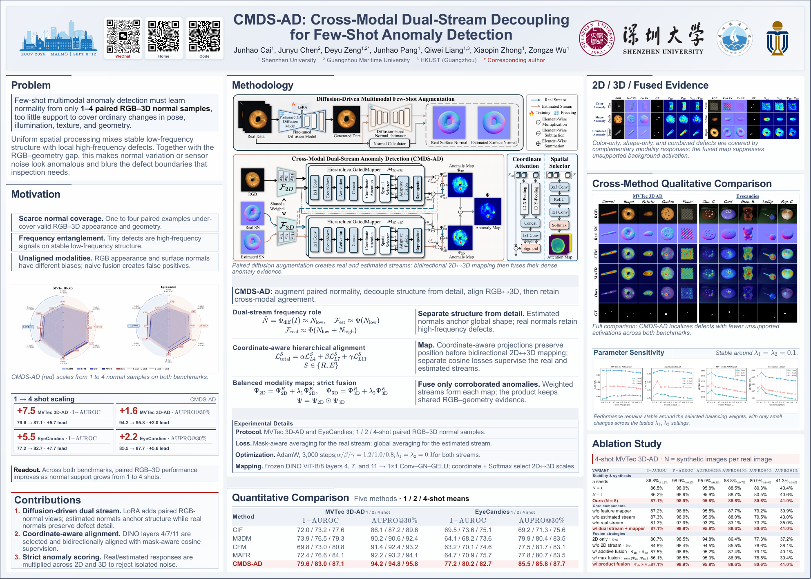

# CMDS-AD: Cross-Modal Dual-Stream Decoupling for Few-Shot Anomaly Detection

<p align="center">
  <a href="https://arxiv.org/abs/2606.20300"></a>
  <a href="https://cmds-ad.github.io/"></a>
  <a href="https://drive.google.com/drive/folders/1iY8wpAr5hy58NobtVsczsUSJSqPGbU1f?usp=sharing"></a>
  <a href="https://drive.google.com/drive/folders/1frxWmADRgxv-W9CVDWJdnHYZRG_5FdNZ?usp=sharing"></a>
  <a href="https://drive.google.com/drive/folders/1mMaKN-oPRo2KqjjuxsdcwDdq2cvnJ5fk?usp=drive_link"></a>
  <a href="https://huggingface.co/Junhaocai27/CMDS-AD"></a>
</p>

### ECCV 2026 Poster

[](./CMDS-AD_ECCV2026_Poster.pdf)

Official implementation of CMDS-AD, a cross-modal few-shot anomaly detection
framework for 3D industrial inspection. This repository includes the complete
preprocessing, RGB augmentation, real/estimated normal generation,
foreground-mask generation, dual-direction training, and evaluation pipeline.

## 📰 News

- **Jun 18, 2026** · CMDS-AD was accepted to ECCV 2026.
- **Jun 20, 2026** · We released the arXiv version and project page.
- **Jul 31, 2026** · We released the complete source code and trained weights.
- **Aug 4, 2026** · We released the pretrained checkpoints on Hugging Face and Google Drive for reproducibility.
- **Aug 18, 2026** · We released the independently retrained RTX 4090 checkpoints and verified that their performance is comparable to the RTX 5090 submission weights on both MVTec 3D-AD and Eyecandies.

## 🚀 Quick start

Choose the route that matches your goal:

| Route | Use when | Main stages |
|---|---|---|
| **Evaluate released weights** | You want the reported result without retraining | Dataset → test normals → foreground masks → inference |
| **Reproduce from scratch** | You want to recreate the complete training pipeline | Dataset → LoRA/i2i → normals/masks → CMDS-AD training → inference |

The complete workflow uses original RGB, generated RGB, real normals, estimated
normals, and foreground masks. Anomaly ground-truth masks are used for test
metrics; foreground masks are used as the object-region constraint.

## 📦 Released weights

Download the paper-submission 2D→3D/3D→2D checkpoints from the **SUBMISSION
CHECKPOINTS** badge and the category-specific LoRA files from the **LORA
WEIGHTS** badge above. The independently retrained package is available from
the **RETRAINED CHECKPOINTS** badge. After extracting either checkpoint
package, the expected layout is:

```text
weights/lora_mvtec/<class>/final_lora.safetensors
weights/lora_eyecandies/<class>/final_lora.safetensors

checkpoints/checkpoints_dual_2dto3d_<class>_<shots>shot/
checkpoints/checkpoints_dual_3dto2d_<class>_<shots>shot/
checkpoints/checkpoints_eyecandies_dual_2dto3d_<class>_<shots>shot/
checkpoints/checkpoints_eyecandies_dual_3dto2d_<class>_<shots>shot/
```

Each CMDS-AD checkpoint directory contains the corresponding
`model_real_*_final.pth` and `model_est_*_final.pth` files. The available shot
values are `1`, `2`, and `4`; inference selects them with `_1shot`, `_2shot`,
or `_4shot`.

The release archive is source-only with respect to external assets: it does
not include MVTec 3D-AD, Eyecandies, Stable Diffusion 2.1, Marigold, or DINO.
Download those assets as described below.

### 🖥️ Checkpoint versions and validation

We provide two complete checkpoint versions. The **SUBMISSION CHECKPOINTS**
badge links to the weights used for the paper submission, trained and
evaluated on NVIDIA RTX 5090 GPUs. The **RETRAINED CHECKPOINTS** badge links to
the independent weights retrained and evaluated on NVIDIA RTX 4090 GPUs with
the 24 GB-safe configuration.

| Version | Training and inference hardware | Role |
|---|---|---|
| Submission checkpoints | NVIDIA RTX 5090 | Weights used for the paper results |
| Retrained checkpoints | NVIDIA RTX 4090 | Independent reproduction from scratch |

The retrained package was trained from scratch on the 24 GB-safe configuration
with
`batch_size=1`, using both the generated RGB/estimated-normal stream and the
real RGB/real-normal/mask stream. It covers both datasets, all ten categories
per dataset, 1/2/4-shot settings, and both 2D→3D and 3D→2D directions.

Download the complete retrained package from the **RETRAINED CHECKPOINTS**
badge above. Its results were evaluated with the same test RGB, test real
normals, test estimated normals, foreground masks, and inference protocol as
the released checkpoints.

The retrained package contains the final model files and follows the
checkpoint layout described above. The LoRA files are distributed separately
through the **LORA WEIGHTS** badge and should be placed under
`weights/lora_mvtec/<class>/final_lora.safetensors` and
`weights/lora_eyecandies/<class>/final_lora.safetensors`.

The main validation metrics are shown below. All metric values are percentages;
the change columns are signed changes in percentage points, computed as
`retrained (4090) - submission (5090)`. Positive values indicate an increase;
negative values indicate a decrease.

| Dataset | Shots | Submission (5090) I&#8209;AUROC | Submission (5090) AUPRO@30% | Retrained (4090) I&#8209;AUROC | Retrained (4090) AUPRO@30% | Change I&#8209;AUROC | Change AUPRO@30% |
|---|---:|---:|---:|---:|---:|---:|---:|
| MVTec&nbsp;3D&#8209;AD | 1 | 79.60 | 94.20 | 79.58 | 94.15 | -0.02 | -0.05 |
| MVTec&nbsp;3D&#8209;AD | 2 | 83.00 | 94.80 | 81.84 | 94.55 | -1.16 | -0.25 |
| MVTec&nbsp;3D&#8209;AD | 4 | 87.10 | 95.80 | 87.38 | 95.78 | +0.28 | -0.02 |
| Eyecandies | 1 | 77.20 | 85.50 | 76.78 | 85.14 | -0.42 | -0.36 |
| Eyecandies | 2 | 80.20 | 85.80 | 79.94 | 86.36 | -0.26 | +0.56 |
| Eyecandies | 4 | 82.70 | 87.70 | 84.27 | 87.47 | +1.57 | -0.23 |

The retrained version remains close to the submission version overall. I-AUROC
increases by 1.57 points on Eyecandies 4-shot, while AUPRO@30% increases by
0.56 points on Eyecandies 2-shot. The largest decreases are 1.16 I-AUROC
points on MVTec 3D-AD 2-shot and 0.36 AUPRO@30% points on Eyecandies 1-shot.
Because the training scripts do not force a fully deterministic
CUDA/random-number configuration, these values measure practical
cross-hardware reproduction rather than an exact hardware-isolation
experiment.

For released-checkpoint evaluation, skip LoRA training, i2i generation, and
CMDS-AD training. Prepare the dataset, generate the test normal maps and
foreground masks, then follow [Inference](#-inference).

### ⚡ Fast evaluation with released checkpoints

This path does not require LoRA, Stable Diffusion, i2i generation, or
CMDS-AD retraining. It requires the dataset, DINO, Marigold, PointNet2, and
the CMDS-AD checkpoints:

```text
1. Download and extract the CMDS-AD checkpoints.
2. Complete Dataset preparation.
3. Choose one Dataset profile.
4. Run only the test-split commands in steps 3 and 4 below.
5. Run the matching foreground-mask block in step 5.
6. Set the checkpoint prefix and run Inference.
```

Do not run the LoRA/i2i commands or the CMDS-AD training command on this path.
Inference uses original test RGB together with test real normals, test
estimated normals, foreground masks, and the released checkpoints.

## 🧰 Setup

Linux, CUDA, and Python 3.10 are recommended. Install a compatible
PyTorch/torchvision pair for the NVIDIA driver before installing the remaining
requirements.

```bash
git clone https://github.com/Junhaocai27/CMDS-AD.git
cd CMDS-AD
conda create -n cmds-ad python=3.10 -y
conda activate cmds-ad
python -m pip install --upgrade pip
python -m pip install -r requirements-pytorch-cu128.txt
python -m pip install -r requirements.txt
mkdir -p data/raw data/derived weights checkpoints results
```

`requirements-pytorch-cu128.txt` installs the exact PyTorch 2.7.0 and
torchvision 0.22.0 CUDA 12.8 pair used for validation. If using another
supported CUDA runtime, install its compatible PyTorch/torchvision pair in the
same place, then install `requirements.txt`.

Install PointNet2 for foreground-mask generation:

```bash
POINTNET2_DIR="$PWD/../Pointnet2_PyTorch"
git clone https://github.com/erikwijmans/Pointnet2_PyTorch.git "$POINTNET2_DIR"
python -m pip install -e "$POINTNET2_DIR/pointnet2_ops_lib"
```

The LoRA stage follows the upstream [LoRA PTI interface](https://github.com/cloneofsimo/lora)
and uses the vendored `lora_pti` entry point:

```bash
python -m pip install -r third_party/lora_requirements.txt
python -m pip install -e third_party --no-deps
command -v lora_pti
lora_pti --help
```

The `--no-deps` flag prevents the LoRA package from replacing the selected
PyTorch/CUDA stack. The preceding requirements file installs the LoRA-specific
dependencies.

### 🔗 Datasets and model assets

| Asset | Download/source | Used for |
|---|---|---|
| MVTec&nbsp;3D&#8209;AD | [Dataset page](https://www.mvtec.com/research-teaching/datasets/mvtec-3d-ad) | RGB, XYZ, anomaly GT |
| Eyecandies | [Dataset page](https://github.com/eyecan-ai/eyecandies) | RGB, XYZ, anomaly GT |
| Stable Diffusion 2.1 | [Hugging Face model card](https://huggingface.co/sd-research/stable-diffusion-2-1-base) | LoRA and i2i RGB |
| Marigold normals | [Hugging Face model card](https://huggingface.co/prs-eth/marigold-normals-v1-1) | Estimated normals |
| DINO ViT-B/8 | [Hugging Face model card](https://huggingface.co/timm/vit_base_patch8_224.dino) | RGB/normal features |

Place MVTec categories directly under `data/raw/mvtec_3d/`:

```text
data/raw/mvtec_3d/{bagel,cable_gland,carrot,cookie,dowel,foam,peach,potato,rope,tire}/
```

Download Eyecandies with the official downloader:

```bash
EYE_DIR="$PWD/../eyecandies"
git clone https://github.com/eyecan-ai/eyecandies.git "$EYE_DIR"
python -m pip install -e "$EYE_DIR[torch]"
eyec ec-get +o "$PWD/data/raw/Eyecandies"
```

Download Stable Diffusion and Marigold with the Hugging Face CLI. Stable
Diffusion requires accepting its license and, when requested, running `hf auth
login`.

```bash
python -m pip install -U "huggingface_hub[cli]"
hf download stabilityai/stable-diffusion-2-1-base \
  --local-dir weights/stable-diffusion-2-1-base
hf download prs-eth/marigold-normals-v1-1 \
  --local-dir weights/marigold
hf download timm/vit_base_patch8_224.dino
```

DINO is loaded through `timm` and is normally stored in the Hugging Face
cache. Set `HF_HOME` if a different cache location is required.

## 🧪 Dataset preparation

Keep the raw datasets unchanged. MVTec preprocessing modifies XYZ TIFF files
in place, so preprocess a copy.

### MVTec 3D-AD

```bash
cp -a data/raw/mvtec_3d data/derived/mvtec_3d
python processing/preprocess_mvtec3dad.py \
  --dataset_path data/derived/mvtec_3d
```

The converted tree contains RGB, XYZ, and test anomaly annotations:

```text
data/derived/mvtec_3d/bagel/train/good/rgb/
data/derived/mvtec_3d/bagel/train/good/xyz/
data/derived/mvtec_3d/bagel/test/<defect>/{rgb,xyz,gt}/
```

Retain the MVTec `gt/` files. They are anomaly ground-truth masks for test
metrics; `test/good` is normal and may omit an explicit all-zero mask.

### Eyecandies

```bash
python processing/preprocess_eyecandies.py \
  --dataset_path data/raw/Eyecandies \
  --target_dir data/derived/eyecandies_mvtec_format
```

The converter creates an MVTec-like RGB/XYZ/test-mask layout. The standard
conversion writes XYZ, so real normals are computed from XYZ by the Open3D
stage below. Anomaly ground truth and foreground masks are different: only
ground truth is used for metrics, while foreground masks are used by the model.

Validate the converted annotations before a full experiment:

```bash
python scripts/validate_dataset.py \
  --dataset mvtec \
  --dataset_root data/derived/mvtec_3d \
  --splits test
python scripts/validate_dataset.py \
  --dataset eyecandies \
  --dataset_root data/derived/eyecandies_mvtec_format \
  --splits test
```

For the complete datasets, the expected test totals are 1,197 MVTec images
with 948 anomalous images and 500 Eyecandies images with 240 anomalous images.

## 🔄 RGB, normals, and foreground masks

Choose exactly one profile below and run its variable block in the current
shell. `CLASSES` is a whitespace-separated list; change it for a small smoke
test or use the complete class list for the reported experiment.

### Dataset profiles

#### MVTec 3D-AD

```bash
DATASET=mvtec
CLASSES="bagel carrot"
DATASET_ROOT="$PWD/data/derived/mvtec_3d"
RGB_ROOT="$PWD/data/derived/output_generation_full"
TRAIN_REAL_ROOT="$PWD/data/derived/normal_output_train_new_full/real_normals"
TRAIN_EST_ROOT="$PWD/data/derived/normal_output_train_new_full/estimated_normals"
TEST_REAL_ROOT="$PWD/data/derived/normal_output_mv_format_infer/real_normals"
TEST_EST_ROOT="$PWD/data/derived/normal_output_mv_format_infer/estimated_normals"
MASK_ROOT="$PWD/data/derived/mvtec_3d_masks_generated"
LORA_ROOT="$PWD/weights/lora_mvtec"
SD_MODEL="$PWD/weights/stable-diffusion-2-1-base"
GPUS="0,1"  # use "0" on a single-GPU machine
```

Available classes: `bagel cable_gland carrot cookie dowel foam peach potato rope tire`.

#### Eyecandies

```bash
DATASET=eyecandies
CLASSES="CandyCane ChocolateCookie"
DATASET_ROOT="$PWD/data/derived/eyecandies_mvtec_format"
RGB_ROOT="$PWD/data/derived/output_generation_eyecandies"
TRAIN_REAL_ROOT="$PWD/data/derived/normal_output_train_eyecandies/real_normals"
TRAIN_EST_ROOT="$PWD/data/derived/normal_output_train_eyecandies/estimated_normals"
TEST_REAL_ROOT="$PWD/data/derived/normal_output_eyecandies_infer/real_normals"
TEST_EST_ROOT="$PWD/data/derived/normal_output_eyecandies_infer/estimated_normals"
MASK_ROOT="$PWD/data/derived/eyecandies_masks_generated"
LORA_ROOT="$PWD/weights/lora_eyecandies"
SD_MODEL="$PWD/weights/stable-diffusion-2-1-base"
GPUS="0,1"
```

Available classes: `CandyCane ChocolateCookie ChocolatePraline Confetto GummyBear HazelnutTruffle LicoriceSandwich Lollipop Marshmallow PeppermintCandy`.

### 1. Copy original training RGB

This creates the flat RGB root used by LoRA, i2i, and the estimated-normal
stage. The i2i generator then adds five generated images per original image.

```bash
python scripts/prepare_rgb.py \
  --dataset "$DATASET" \
  --dataset_root "$DATASET_ROOT" \
  --output_root "$RGB_ROOT" \
  --classes $CLASSES
```

### 2. Train LoRA and generate i2i RGB

Run only the block matching the selected dataset. The `CMDS_AD_*` variables
are scoped to each command and do not need to be set globally.

<details>
<summary>🖼️ MVTec 3D-AD LoRA and i2i commands</summary>

```bash
CMDS_AD_CLASSES="$CLASSES" CMDS_AD_GPUS="$GPUS" \
CMDS_AD_SD_MODEL="$SD_MODEL" CMDS_AD_MVTEC_ROOT="$DATASET_ROOT" \
CMDS_AD_MVTEC_LORA_ROOT="$LORA_ROOT" \
python scripts/train_lora_mvtec3dad.py

CMDS_AD_CLASSES="$CLASSES" CMDS_AD_GPUS="$GPUS" \
CMDS_AD_SD_MODEL="$SD_MODEL" CMDS_AD_MVTEC_ROOT="$DATASET_ROOT" \
CMDS_AD_MVTEC_LORA_ROOT="$LORA_ROOT" \
CMDS_AD_MVTEC_RGB_ROOT="$RGB_ROOT" \
python scripts/generate_rgb_mvtec3dad.py
```

</details>

<details>
<summary>🍬 Eyecandies LoRA and i2i commands</summary>

```bash
CMDS_AD_CLASSES="$CLASSES" CMDS_AD_GPUS="$GPUS" \
CMDS_AD_SD_MODEL="$SD_MODEL" CMDS_AD_EYECANDIES_ROOT="$DATASET_ROOT" \
CMDS_AD_EYECANDIES_LORA_ROOT="$LORA_ROOT" \
python scripts/train_lora_eyecandies.py

CMDS_AD_CLASSES="$CLASSES" CMDS_AD_GPUS="$GPUS" \
CMDS_AD_SD_MODEL="$SD_MODEL" CMDS_AD_EYECANDIES_ROOT="$DATASET_ROOT" \
CMDS_AD_EYECANDIES_LORA_ROOT="$LORA_ROOT" \
CMDS_AD_EYECANDIES_RGB_ROOT="$RGB_ROOT" \
python scripts/generate_rgb_eyecandies.py
```

</details>

The fixed i2i seeds are `42`, `1024`, `2026`, `8888`, and `12345`. The
defaults are strength `0.2`, guidance scale `4`, and 50 diffusion steps. If
an output directory was created with another seed list, rerun i2i rather than
renaming old files; the filename should match the image content.

### 3. Generate real normals

Real normals are computed from XYZ with CUDA Open3D using `radius=0.01` and
`max_nn=30`. Generate separate training and test roots:

```bash
python scripts/generate_real_normals.py \
  --dataset "$DATASET" \
  --dataset_root "$DATASET_ROOT" \
  --output_root "$TRAIN_REAL_ROOT" \
  --classes $CLASSES \
  --splits train \
  --device cuda

python scripts/generate_real_normals.py \
  --dataset "$DATASET" \
  --dataset_root "$DATASET_ROOT" \
  --output_root "$TEST_REAL_ROOT" \
  --classes $CLASSES \
  --splits test \
  --device cuda
```

### 4. Generate estimated normals with Marigold

The validated settings are `denoise_steps=10`, `ensemble_size=10`, `seed=42`,
the model's default resolution, full precision, and batch size 1.

```bash
python scripts/generate_estimated_normals.py \
  --dataset "$DATASET" \
  --dataset_root "$DATASET_ROOT" \
  --rgb_root "$RGB_ROOT" \
  --output_root "$TRAIN_EST_ROOT" \
  --checkpoint weights/marigold \
  --classes $CLASSES \
  --splits train \
  --batch_size 1 \
  --seed 42 \
  --denoise_steps 10 \
  --device cuda

python scripts/generate_estimated_normals.py \
  --dataset "$DATASET" \
  --dataset_root "$DATASET_ROOT" \
  --output_root "$TEST_EST_ROOT" \
  --checkpoint weights/marigold \
  --classes $CLASSES \
  --splits test \
  --batch_size 1 \
  --seed 42 \
  --denoise_steps 10 \
  --device cuda
```

Training estimated normals use the original and generated RGB images. Test
estimated normals use the original test RGB images.

### 5. Generate foreground masks

Run the matching block. Use `--class_name all` for the complete dataset, or
replace it with one selected class for a smoke test.

<details>
<summary>🎯 MVTec 3D-AD foreground masks</summary>

```bash
python mask_vis_mvtec3dad.py \
  --dataset_path "$DATASET_ROOT" \
  --save_dir "$MASK_ROOT" \
  --class_name all \
  --batch_size 1
```

</details>

<details>
<summary>🎯 Eyecandies foreground masks</summary>

```bash
python mask_vis_eyecandies.py \
  --dataset_path "$DATASET_ROOT" \
  --save_dir "$MASK_ROOT" \
  --class_name all \
  --batch_size 1
```

</details>

## 🧠 CMDS-AD training

The real stream uses original RGB, real normals, and foreground masks. The
estimated stream uses original/generated RGB and Marigold normals. Generated
RGB stems reuse the corresponding original real-normal and foreground-mask
files.

| shots | 1 | 2 | 4 |
|---|---:|---:|---:|
| default training steps | 3000 | 1500 | 750 |

Train both directions for the selected classes:

```bash
python scripts/train.py \
  --dataset "$DATASET" \
  --classes $CLASSES \
  --rgb_root "$RGB_ROOT" \
  --real_normal_root "$TRAIN_REAL_ROOT" \
  --est_normal_root "$TRAIN_EST_ROOT" \
  --mask_root "$MASK_ROOT" \
  --shots 1 2 4 \
  --directions both \
  --batch_size 1 \
  --device cuda \
  --checkpoint_root checkpoints \
  --wandb_mode disabled
```

`--batch_size 1` is the validated configuration for a 24 GB GPU. On a GPU
with at least 32 GB, `--batch_size 2` can be used. Set `--directions` to
`2dto3d` or `3dto2d` to train one direction only. Use `--max_steps` only when
intentionally overriding the shot schedule.

## 🔍 Inference

Use the same dataset profile and normal/mask roots as above. Set the
checkpoint prefixes for the selected dataset:

```bash
# MVTec 3D-AD
INFER_SCRIPT=test_anomaly_fusion_mvtec3dad.py
CKPT_ROOT_3D2D=checkpoints/checkpoints_dual_3dto2d
CKPT_ROOT_2D3D=checkpoints/checkpoints_dual_2dto3d

# Eyecandies (use these instead for the Eyecandies profile)
# INFER_SCRIPT=test_anomaly_fusion_eyecandies.py
# CKPT_ROOT_3D2D=checkpoints/checkpoints_eyecandies_dual_3dto2d
# CKPT_ROOT_2D3D=checkpoints/checkpoints_eyecandies_dual_2dto3d

CKPT_SUFFIX=_1shot  # choose _1shot, _2shot, or _4shot
RESULT_FILE=results/${DATASET}_result.txt
mkdir -p results
```

Run evaluation with the original test RGB, test real normals, test estimated
normals, foreground masks, and anomaly ground truth:

```bash
python "$INFER_SCRIPT" \
  --dataset_root "$DATASET_ROOT" \
  --real_normal_root "$TEST_REAL_ROOT" \
  --est_normal_root "$TEST_EST_ROOT" \
  --mask_root "$MASK_ROOT" \
  --ckpt_root_3d2d "$CKPT_ROOT_3D2D" \
  --ckpt_root_2d3d "$CKPT_ROOT_2D3D" \
  --ckpt_suffix "$CKPT_SUFFIX" \
  --classes $CLASSES \
  --batch_size 1 \
  --device cuda \
  --wandb_mode disabled \
  2>&1 | tee "$RESULT_FILE"
```

Use `--max_samples 1` for a smoke test and remove it for reported metrics.
The evaluator prints I-AUROC, P-AUROC, and AUPRO. Original test RGB is used
for evaluation; generated RGB enlarges the training stream only.

<details>
<summary>📋 Expected data layout</summary>

```text
Training:
<RGB_ROOT>/<class>/
<TRAIN_REAL_ROOT>/<class>/train/good/
<TRAIN_EST_ROOT>/<class>/train/good/normals_vis/
<MASK_ROOT>/<class>/train/good/

Test:
<DATASET_ROOT>/<class>/test/<defect>/{rgb,xyz,gt}/
<TEST_REAL_ROOT>/<class>/test/<defect>/
<TEST_EST_ROOT>/<class>/test/<defect>/normals_vis/
<MASK_ROOT>/<class>/test/<defect>/
```

Estimated normals contain one file per RGB image. Real normals and foreground
masks are indexed by the original image stem and reused for generated training
variants.

</details>

## ✅ Validation

Run the structural checks and one-class dry runs before a full experiment:

```bash
python scripts/validate_release.py
python -m compileall -q .
python scripts/validate_dataset.py \
  --dataset mvtec --dataset_root data/derived/mvtec_3d --splits test
python scripts/validate_dataset.py \
  --dataset eyecandies \
  --dataset_root data/derived/eyecandies_mvtec_format \
  --splits test
python scripts/train.py \
  --dataset mvtec --classes bagel --shots 1 --directions both --dry-run
python scripts/generate_estimated_normals.py \
  --dataset mvtec --classes bagel \
  --checkpoint weights/marigold --dry-run
```

Before a full run, validate one class through LoRA, i2i, real-normal,
Marigold, foreground-mask, and inference stages with `--max_samples 1` where
available. CUDA normal maps can differ slightly across GPU models.

## 📚 Citation

```bibtex
@article{cmdsad2026,
  title   = {CMDS-AD: Cross-Modal Dual-Stream Decoupling for Few-Shot Anomaly Detection},
  journal = {arXiv preprint arXiv:2606.20300},
  year    = {2026}
}
```

## 🙏 Acknowledgements

This project builds on and/or uses the following open-source projects:

- [CFM — Crossmodal Feature Mapping](https://github.com/CVLAB-Unibo/crossmodal-feature-mapping)
- [Marigold](https://github.com/prs-eth/Marigold)
- [DINO / pytorch-image-models](https://github.com/huggingface/pytorch-image-models)
- [Stable Diffusion](https://github.com/Stability-AI/stablediffusion)
- [LoRA Diffusion](https://github.com/cloneofsimo/lora)
- [Open3D](https://github.com/isl-org/Open3D)
- [PointNet2](https://github.com/erikwijmans/Pointnet2_PyTorch)
- [Point-MAE](https://github.com/Pang-Yunsheng/Point-MAE)
- [Eyecandies](https://github.com/eyecan-ai/eyecandies)

Please review all upstream licenses, model cards, and dataset terms before
redistribution or commercial use. See [LICENSE](LICENSE) and the license files
under `third_party/`.
